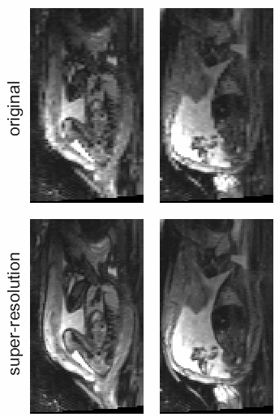

# fetalSR

STRESS: Super-Resolution for Dynamic Fetal MRI using Self-Supervised Learning ([Springer](https://link.springer.com/chapter/10.1007/978-3-030-87234-2_19)|[arXiv](https://arxiv.org/abs/2106.12407))

<p align="center">
    
</p>

## Usage

Run ```python main.py``` to train a model and test on the simulated dataset.

You may create your own dataset following `EPIDataset` in `data.py`.

## Cite our work

```
@inproceedings{xu2021stress,
  title={STRESS: Super-Resolution for Dynamic Fetal MRI Using Self-supervised Learning},
  author={Xu, Junshen and Abaci Turk, Esra and Grant, P Ellen and Golland, Polina and Adalsteinsson, Elfar},
  booktitle={International Conference on Medical Image Computing and Computer-Assisted Intervention},
  pages={197--206},
  year={2021},
  organization={Springer}
}
```
